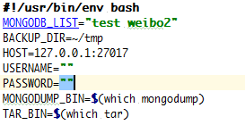
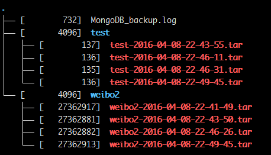
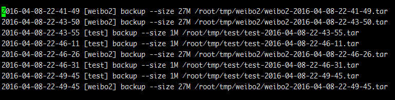

# Mongodb backup script
---
## Auto backup MongoDB database shell script

## USAGE
Variable | Describe  
------------ | -------------
MONGODB_LIST | List you want to backup
BACKUP_DIR | Store your backup files
HOST|database host (port)
USERNAME|user name
PASSWORD|password

## Backup all Database Or Backup specify Database in MONGODB_LIST
If MONGODB_LIST is null backup all  
Else backup specify list  

- ./MongoDB_BackUp  

## Specify Database
- ./MongoDB_BackUp  test

## Specify Database list
- ./MongoDB_BackUp  test1 test2

## You can move the script to /etc/cron.daily or /etc/hourly

## tree -s

## Log

